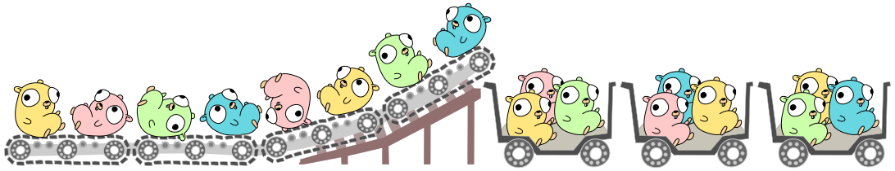

[](https://pkg.go.dev/mod/github.com/ubntc/go/batching/batbq)
[](https://goreportcard.com/report/github.com/ubntc/go/batcher/batbq)
[](Makefile#10)

# Batched BigQuery Inserter

[](https://github.com/ubntc/go/blob/master/batching/batbq)

Batbq package implements batching of messages for the `bigquery.Inserter` and provides the following features:

1. batching of messages from a channel into a slice to be sent to BigQuery,
2. time-based flushing of partially filled batches,
3. row-wise handling of insert errors,
4. confirmation of messages at the sender (Ack/Nack),
5. comprehensive pipeline metrics for one or more batchers,
6. basic autoscaling to create batches in parallel from an input channel.

## Usage

```golang
package main

import (
	"context"
	"flag"
	"log"
	"os"
	"time"

	"cloud.google.com/go/bigquery"
	"github.com/ubntc/go/batching/batbq"
	custom "github.com/ubntc/go/batching/batbq/_examples/simple/dummy"
)

var schema bigquery.Schema

func init() { schema, _ = bigquery.InferSchema(custom.Message{}) }

// Msg wraps the received data and implements batbq.Message.
type Msg struct {
	m *custom.Message // custom type providing data values and confirmation handlers
}

// Ack acknowledges the original message.
func (msg *Msg) Ack() { msg.m.ConfirmMessage() }

// Nack handles insert errors.
func (msg *Msg) Nack(err error) {
	if err != nil {
		log.Print(err)
	}
}

// Data returns the message as bigquery.StructSaver.
func (msg *Msg) Data() bigquery.ValueSaver {
	return &bigquery.StructSaver{InsertID: msg.m.ID, Struct: msg.m, Schema: schema}
}

func main() {
	source := custom.NewSource("src_name") // custom data source

	ctx := context.Background()
	client, _ := bigquery.NewClient(ctx, os.Getenv("GOOGLE_CLOUD_PROJECT"))
	output := client.Dataset("tmp").Table("batbq").Inserter()

	cfg := batbq.BatcherConfig{
		Capacity:      100,
		FlushInterval: time.Second,
	}

	input := make(chan batbq.Message, cfg.Capacity)
	batcher := batbq.NewInsertBatcher("custom_message", cfg)

	go func() {
		source.Receive(ctx, func(m *custom.Message) { input <- &Msg{m} })
		close(input)
	}()

	batcher.Process(ctx, input, output)
}
```

Also see the [PubSub to BigQuery](_examples/ps2bq/main.go) example.


## Batcher Design

The package provides an `InsertBatcher` that requires an `input <-chan batbq.Message` to collect
individual messages from a streaming data source as shown in the [examples](_examples).
The `InsertBatcher` also requires a `Putter` that implements `Put(context.Context, interface{})`
as provided by the regular `bigquery.Inserter`. Messages that are `Put` into the `bigquery.Inserter`
need to implement the `bigquery.ValueSaver`.

Batbq defines a [`batbq.Message`](message.go) interface to handle the following requirements.

* Provide `bigquery.ValueSaver` data.
* Handle insert errors.
* Implement message confirmation using `Ack` and `Nack`.

```golang
// Message defines an (n)ackable message that contains the data for BigQuery.
type Message interface {
	Data() bigquery.ValueSaver // Data returns a ValueSaver for the bigquery.Inserter
	Ack()                      // Ack confirms successful processing of the message at the sender.
	Nack(err error)            // Nack reports unsuccessful processing and errors to the sender.
}
```

Setting up a batch pipeline requires the following steps.

1. Create a custom message type that implements `batbq.Message` providing `Ack()`, `Nack(error)`,
   and `Data() bigquery.ValueSaver`.

2. Create a `Putter` to receive the batches from the `InsertBatcher`.

3. Create a `chan batbq.Message` to pass data to the `InsertBatcher`.

4. In a goroutine, receive and wrap messages from a data source and send them to the channel as
   `batbq.Message`.

5. Start the batcher using its `Process(context.Context, <-chan batbq.Message, Putter)` method.

For instance, if your data source is PubSub, first register a message handler using
`subscription.Receive(ctx, handler)` in a goroutine, with the `handler` wrapping the
`pubsub.Message` in a `batbq.Message` and sending it to the input channel.
Then start the batcher to receive and batch these messages. The batcher will stop if the context
is canceled or the input channel is closed; there is no "stop" method.
See the full [PubSub to BigQuery](_examples/ps2bq/main.go) example for more details and
options.

## Scaling Parameters

Internally batbq uses a blocking [`worker(...)`](worker.go) function to process data from the input
channel into the current batch. Filled batches are sent to the `Putter` asynchronously.
This introduces a concurrency level that can be controlled on the sender-side by limiting the number
of pending (unconfirmed) messages.

For PubSub, this can done by setting `MaxOutstandingMessages` on a `pubsub.Subscription`.

For most use cases this should be sufficient and you can leave `BatcherConfig.AutoScale = false`
(default). See [SCALING.md](SCALING.md) for more details and benchmarks.

## Multi Batching

The package also provides a `MultiBatcher` that can be set up to batch data from multiple inputs
and outputs in parallel. Please consult the corresponding [test case](multibatcher_test.go) on how
to set it up.
