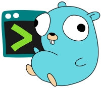

[](https://goreportcard.com/report/github.com/ubntc/go/cli)
[](Makefile#26)

# Go-cli

[](https://github.com/ubntc/go/blob/master/cli)

Go-cli provides common terminal application features for your Go application.

The project is a collection of [DRY code](https://en.wikipedia.org/wiki/Don%27t_repeat_yourself)
for quickly adding common usability features to your commandline application.
To keep the project (and your binaries) small, the scope of this project is limited to the
following three features.

## 1. Signal Handling

Handle `os.Signal` events in cooperation with a `context.Context`.
```go
  // create a context that is canceled by SIGINT or SIGTERM.
  ctx, cancel := cli.WithSigWait(context.Background(), opt...)
```

## 2. Friendly Logs
Setup human-readable colored logging when running interactively.
The log output is as brief as possible using ISO dates, 24h time,
and 3-letter log levels for best readability.
```go
  // read CLI flag and setup interactive logging
  if *interactive {
    cli.SetupLogging(zerologger.Setup)
  }
```
```
  $ go run cmd/app.go -i  # run your app in interactive mode
  > 2020-05-18 20:48:30 DBG message a key=value1
  > 2020-05-18 20:48:31 DBG message b key=value2
```
The setup code for the supported [loggers]() is in separate packages to reduce binary size of the compiled Go applications.
The currently suppported loggers are `zerolog` and the standard `log`.

## 3. Terminal Input
Handle user input in the terminal in combination with signal-waiting functionality. 
```go
  // use cli.WithInput to add commands and auto-setup quit keys: Q, q, CTRL-Q, CTRL-D
  opt = []cli.Option{cli.WithInput(cli.Commands{
    {Name: "help", Key: 'h', Fn: help},
    {Name: "status", Key: 's', Fn: srv.Status},
  })}
  ctx, cancel := cli.WithSigWait(context.Background(), opt...)
```


## Full Example
```go
func main() {
  flag.Parse()                                          // parse -i (interactive) flag

  srv := NewServer()                                    // create your server
  var opt []cli.Option                                  // default options for sigwait context

  if *interactive {                                     // a) setup interactive logging:
    cli.SetupLogging(zerologger.Setup)                  //    setup colored and friendly zerolog
    opt = append(opt, cli.WithInput(cli.Commands{       //    setup Q, q, ^C, ^D to cancel context
      cli.WithCommand{Key: 'h', Fn: help},              //    call custom func when pressing h
      cli.WithCommand{Key: 's', Fn: srv.Status},        //    call custom func when pressing s
    }))
  } else {                                              // b) use regular logging:
    zerolog.TimeFieldFormat = zerolog.TimeFormatUnix    //    setup the logger as usual
  }

  ctx, cancel := cli.WithSigWait(context.Background(), opt...)  // get a context that cancels on
  defer cancel()                                                // os.Signal: SIGTERM or SIGINT

  go srv.Serve(ctx)                                     // use sigwait-context as regular context

  <-ctx.Done()                                          // wait for closing context
  srv.Shutdown()                                        // cleanup server
}
```


